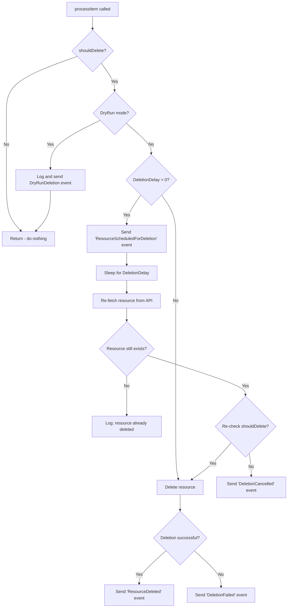

# Delayed Deletion Flow

This document describes how kube-janitor-go handles resource deletion with the configurable delay feature.

## Overview

The delayed deletion feature allows kube-janitor to send an event announcing the upcoming deletion of a resource, wait for a configurable delay period, and then re-evaluate the resource before performing the actual deletion. This provides:

- **Visibility**: Teams are notified before resources are deleted
- **Safety**: Resources can be "saved" by removing TTL annotations during the delay period
- **Auditability**: Events are recorded in Kubernetes for tracking

## Configuration

The deletion delay is configured via the `--deletion-delay` CLI flag:

```bash
kube-janitor-go --deletion-delay=30s
```

Default value: `30s` (30 seconds)

Environment variable: `KUBE_JANITOR_DELETION_DELAY`

### Helm Configuration

When using the Helm chart, set the delay in your values:

```yaml
config:
  deletionDelay: "30s"
```

## Flow Diagram



## Events

The following Kubernetes events are emitted during the deletion process:

| Event Type | Reason | Description |
|------------|--------|-------------|
| Normal | `ResourceScheduledForDeletion` | Resource has been scheduled for deletion after the configured delay |
| Normal | `DeletionCancelled` | Deletion was cancelled because the resource no longer meets deletion criteria |
| Normal | `ResourceDeleted` | Resource was successfully deleted |
| Warning | `DeletionFailed` | Resource deletion failed |
| Normal | `DryRunDeletion` | Resource would have been deleted (dry-run mode) |

## Behavior Details

### Initial Evaluation

When a resource is processed, kube-janitor evaluates whether it should be deleted based on:
- `janitor/ttl` annotation (legacy)
- `janitor/expires` annotation (legacy)
- `janitor/delete-if-max-age` annotation
- `janitor/delete-if-idle` annotation
- `janitor/delete-if-date` annotation
- Custom CEL rules from the rules file

### Delay Period

If `DeletionDelay` is greater than 0:
1. An event is immediately sent to announce the scheduled deletion
2. The janitor waits for the configured delay
3. Context cancellation is respected (for graceful shutdown)

### Re-evaluation

After the delay, the janitor:
1. Re-fetches the resource from the Kubernetes API
2. Checks if the resource still exists (it may have been manually deleted)
3. Re-evaluates all deletion criteria

This allows operators to "rescue" a resource by:
- Removing the TTL/expiration annotations
- Updating the `lastUsedAt` timestamp
- Modifying labels to no longer match rules

### Backward Compatibility

Setting `DeletionDelay` to `0` disables the delay and reverts to immediate deletion behavior (no `ResourceScheduledForDeletion` event, no re-evaluation).

## Example Use Case

A deployment with a 1-hour TTL is about to expire:

1. **T+0s**: Janitor detects the deployment has exceeded its TTL
2. **T+0s**: `ResourceScheduledForDeletion` event is created
3. **T+0-30s**: Team receives alert from event monitoring and removes the TTL annotation
4. **T+30s**: Janitor re-evaluates and finds no TTL annotation
5. **T+30s**: `DeletionCancelled` event is created, deployment is preserved

Without the delay, the deployment would have been deleted at T+0s with no opportunity to intervene.
