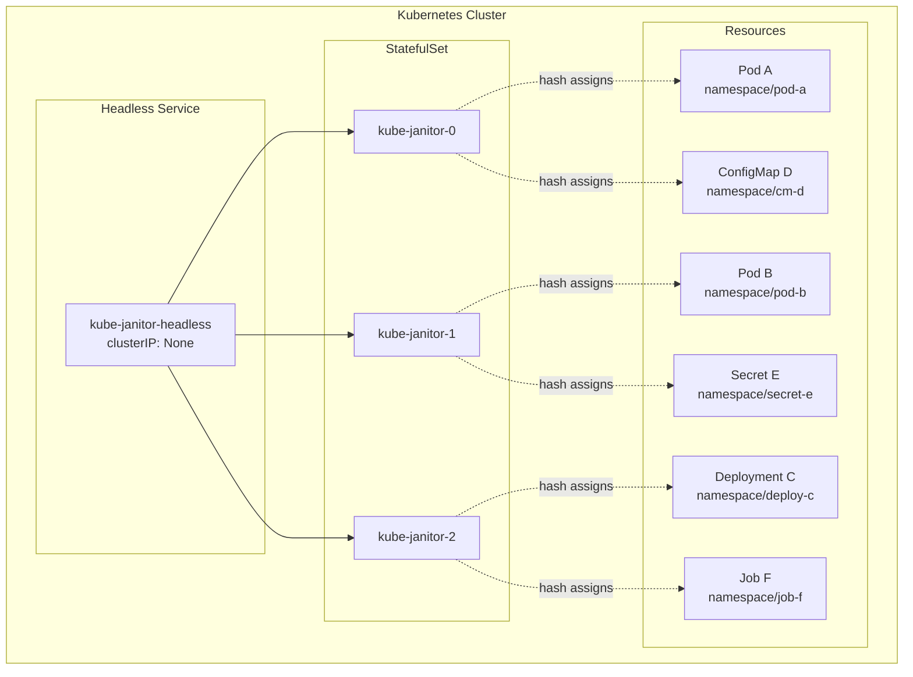
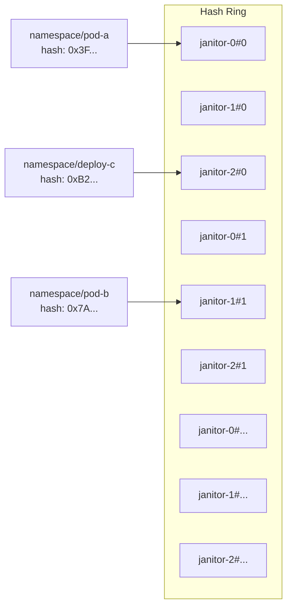
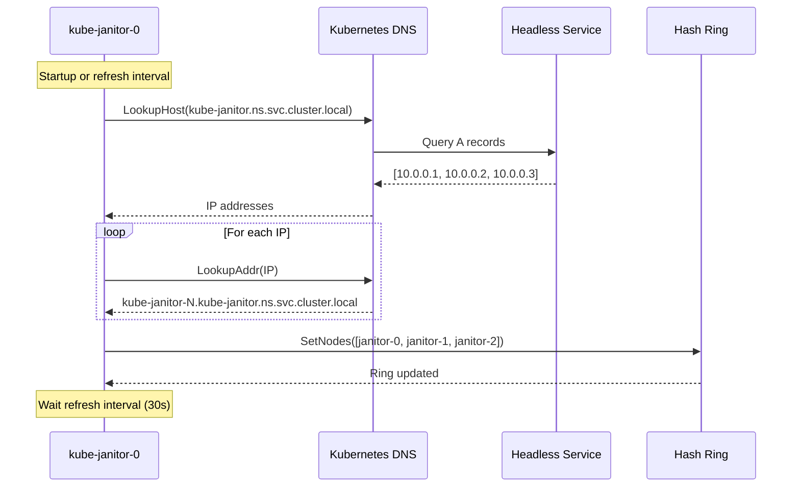
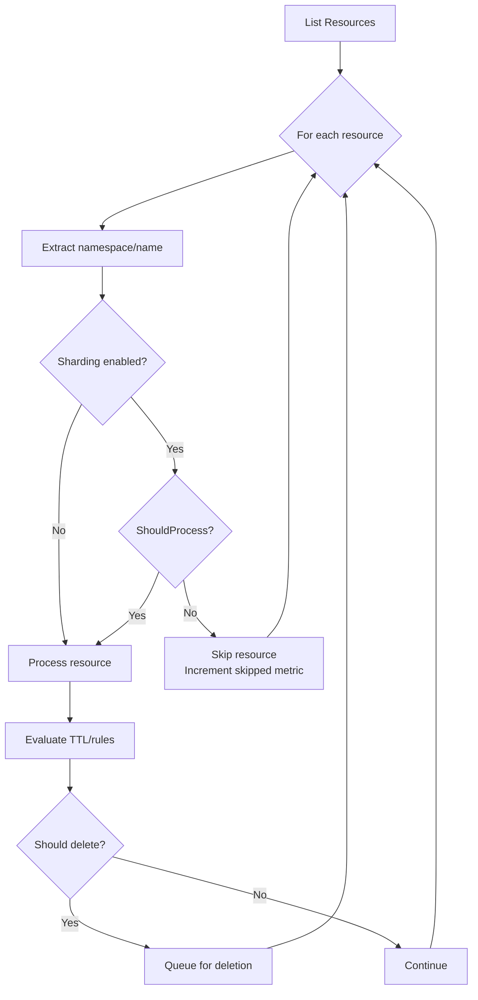
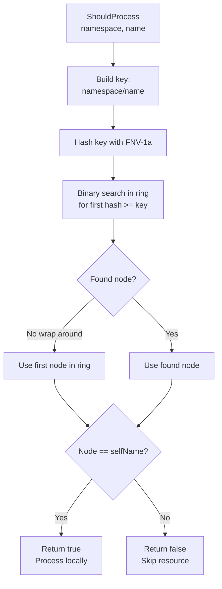
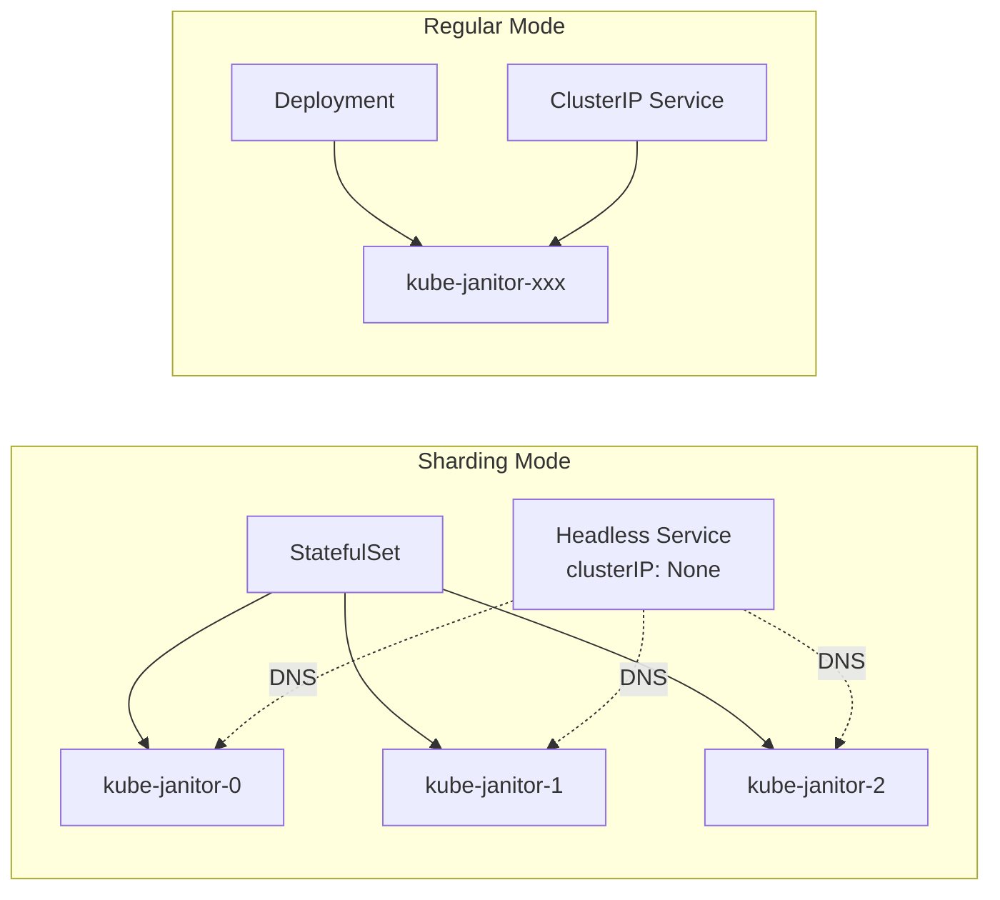
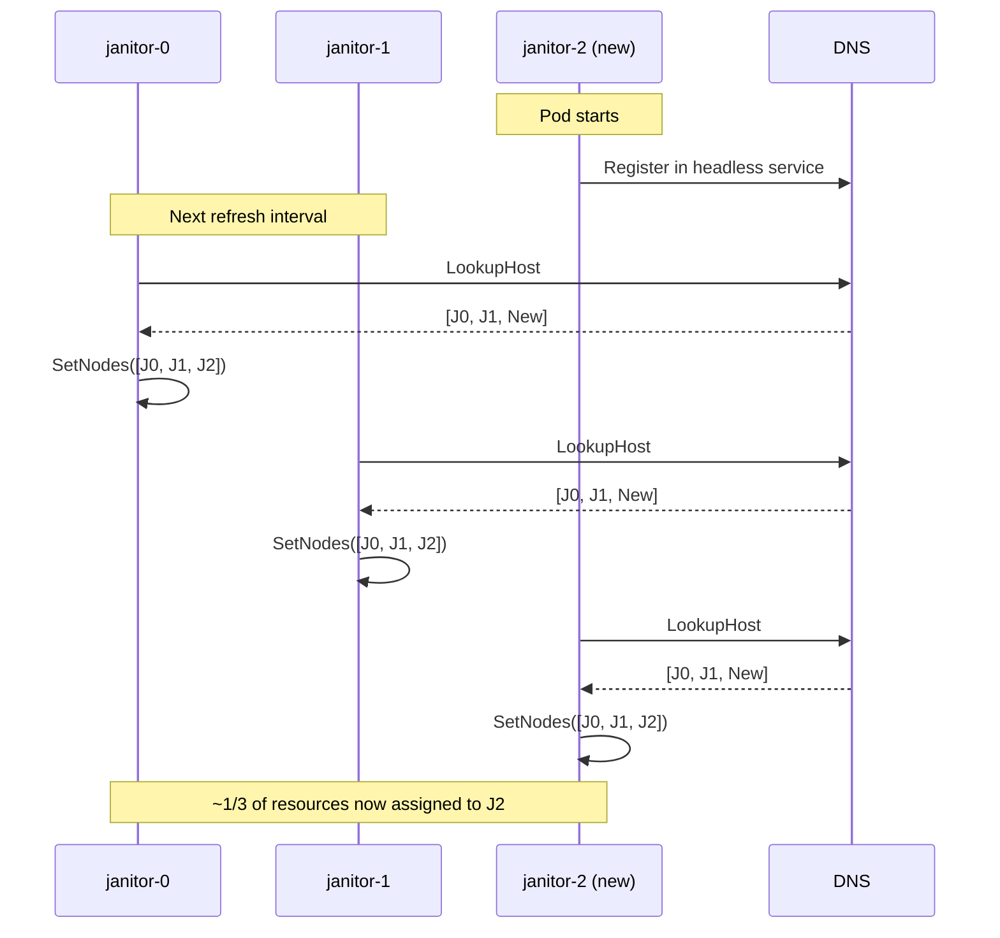

# Sharded Janitor Architecture

This document describes how kube-janitor-go implements horizontal scaling using consistent hashing and peer discovery.

## Overview

When running multiple instances of kube-janitor, sharding ensures that each resource is processed by exactly one janitor instance. This prevents duplicate deletions, reduces API server load, and enables horizontal scaling.

## Architecture



## Components

### 1. Hash Ring (Consistent Hashing)

The hash ring distributes resources across janitor instances using the FNV-1a hash algorithm with virtual nodes for even distribution.



**Key characteristics:**

| Property | Value | Description |
|----------|-------|-------------|
| Hash Algorithm | FNV-1a (64-bit) | Fast, non-cryptographic hash |
| Virtual Nodes | 150 per physical node | Improves distribution uniformity |
| Resource Key | `namespace/name` | Unique identifier for each resource |
| Lookup | O(log n) | Binary search on sorted ring |

### 2. Peer Discovery

Peer discovery uses Kubernetes DNS to find other janitor instances through a headless service.



## Resource Processing Flow



### ShouldProcess Decision



## Configuration

### CLI Flags

```bash
kube-janitor-go \
  --sharding-enabled \
  --sharding-service-name=kube-janitor-headless \
  --sharding-namespace=kube-system \
  --sharding-refresh-interval=30s
```

| Flag | Default | Description |
|------|---------|-------------|
| `--sharding-enabled` | `false` | Enable sharding mode |
| `--sharding-service-name` | `kube-janitor` | Headless service name for DNS discovery |
| `--sharding-namespace` | Current namespace | Namespace where headless service exists |
| `--sharding-refresh-interval` | `30s` | How often to refresh peer list |

### Helm Values

```yaml
sharding:
  enabled: true
  serviceName: ""  # Auto-generated: <release>-headless
  refreshInterval: 30s

replicaCount: 3  # Number of janitor instances
```

### Required Environment Variables

| Variable | Source | Description |
|----------|--------|-------------|
| `HOSTNAME` | Downward API | Pod name for self-identification |
| `POD_NAMESPACE` | Downward API | Namespace for DNS queries |

## Kubernetes Resources

When sharding is enabled, the Helm chart creates:



### StatefulSet (sharding enabled)

- Provides stable, predictable pod names (`kube-janitor-0`, `kube-janitor-1`, etc.)
- Required for consistent hashing identity
- Pods are created/deleted in order

### Headless Service

- `clusterIP: None` enables direct pod DNS resolution
- Returns all pod IPs when queried
- Enables peer discovery without external dependencies

## Metrics

| Metric | Type | Labels | Description |
|--------|------|--------|-------------|
| `kube_janitor_resources_skipped_total` | Counter | resource, namespace | Resources skipped due to sharding |
| `kube_janitor_sharding_peers` | Gauge | - | Number of active peer instances |

## Scaling Behavior

### Adding Instances



### Removing Instances

When a janitor instance is removed:

1. Kubernetes removes the pod from headless service endpoints
2. Remaining instances detect the change on next DNS refresh
3. Resources previously assigned to the removed instance are redistributed
4. Only ~1/N resources need reassignment (consistent hashing property)

## Best Practices

### Replica Count

- **Minimum:** 2 replicas for high availability
- **Recommended:** 3-5 replicas for production
- **Maximum:** Limited by API server capacity and resource count

### Refresh Interval

- **Default:** 30 seconds
- **Lower (10-15s):** Faster reaction to scaling, higher DNS load
- **Higher (60s+):** Less DNS overhead, slower reaction to changes

### Resource Distribution

With 150 virtual nodes per physical node, expect:
- ~98% uniform distribution across instances
- Minimal redistribution during scale events

## Troubleshooting

### Peers Not Discovered

```bash
# Check headless service endpoints
kubectl get endpoints kube-janitor-headless -n <namespace>

# Check DNS resolution from a pod
kubectl exec -it kube-janitor-0 -- nslookup kube-janitor-headless.<namespace>.svc.cluster.local
```

### Uneven Resource Distribution

Enable trace logging to see sharding decisions:

```bash
kube-janitor-go --log-level=trace
```

Look for logs like:
```
Sharding decision for resource namespace=default name=my-pod assignedNode=kube-janitor-1 selfName=kube-janitor-0 shouldProcess=false
```

### Resources Not Being Processed

Check if the hash ring has nodes:

```bash
# Look for this log message
"Set nodes in hash ring" nodes=[janitor-0, janitor-1, janitor-2]
```

If the ring is empty, peer discovery is failing. Check DNS connectivity and service configuration.

